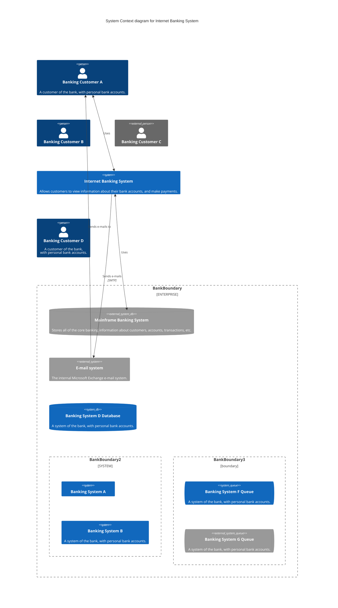

# Click-to-Call Web Integrations

This repo presents samples and easily deployable components to integrate [Amazon Chime Click-to-Call](https://github.com/aws-samples/amazon-chime-sdk-click-to-call) in a general website with the absolute minimal dependencies and a very simple mechanism to include the functionality.

## Assumptions

* The website where Click-to-Call is to be integrated will exercise user management and present the functionality to logged in users so as 
  * secure access the API and backend resources

In this project a small sample website using [Amazon Cognito](https://aws.amazon.com/cognito/) user management, authentication, and authorization is provided for reference.

## Tenets

* Simple integration with minimal footprint (e.g. `<script>` and `
` tags)
  * single url to include
  * single div tag to place

* Provide Higher Order integration patterns (e.g. React Component)

* Allow for configuration of features and styling with tag attributes
  * compatible with Bootstrap
  * integrates with CSS

* Minimal trust of client
  * user must log in
  * logged in user receives an access token which must be passed to the Click-to-Call object to allow the widget to access the backend API to setup the call

## Structure of project

## Backlog of work items -- TODOs

[ ] Storyboard/Wireframe use cases

[ ] Architecture Diagram

[ ] API design (actions/objects) and sequence diagram
